# Who controls your smart devices?

- You are fully in control...

- You can
  - choose what your device does
  - use hardware after official support ends
  - have fun

## Why reprogram with Cursor?

It speeds up
- research
- brainstorm
- coding, building, and flashing your firmware

---

## You can treat firmware like any other codebase

- it directly controls hardware
- .bin, so not human-readable
- but you can rewrite the firmware in C and C++
- compile it and flash it

---

## Quick start

- 0 Confirm that your device can be reprogrammed
- 1 Connect the smart device to your computer
- 2 Pull the factory firmware
- 3 Make a plan
- 4 Write code
- 5 Flash your own firmware

---

### 0. Check reprogram feasibility

- Before bricking the device ask for:
  - uncertainties
  - verify `@critical` the `docs/<device>/0-feasibility.md`

[Example prompt to check feasibility](docs/cursor-example-prompts/0-feasibility.md)

---

### 1. Connect the board from the smart device to your computer

- OTA
- USB-C
- USB adapter

[Example prompt to connect the device](docs/cursor-example-prompts/1-connect.md)

---

### 2. Pull the factory firmware

[Example prompt to pull the factory firmware](docs/cursor-example-prompts/2-dump-firmware.md)

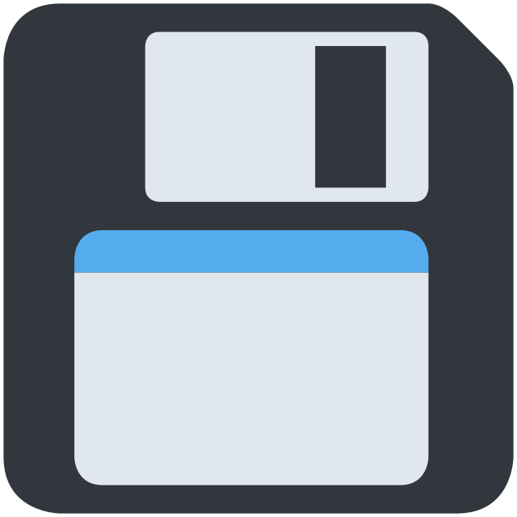

---

### 3. Decide what your device should do

[Example prompt to brainstorm](docs/cursor-example-prompts/3-decide-changes.md)

---

### 4. Write custom firmware in Cursor

[Example prompt to write custom firmware](docs/cursor-example-prompts/4-write-firmware.md)

---

### 5. Flash your firmware

[Example prompt to flash](docs/cursor-example-prompts/5-flash.md)

---

## Devices ready for hands-on reprogramming

- Elecrow AI camera
- Smart plug

### [Elecrow AI Camera (SAD00006D)](https://www.elecrow.com/wiki/AI-Camera-Development-Board-Vision-Sensor-Board-Powered-By-ESP32.html)

- Quick start guide is entirely cloud-oriented [xiaozhi.me](https://xiaozhi.me/).
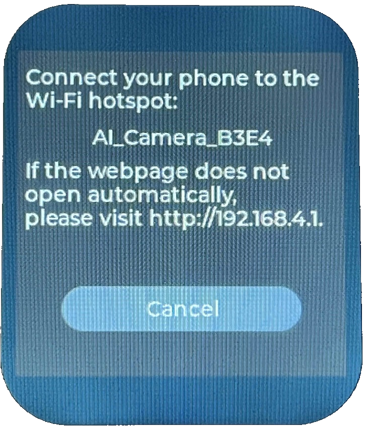

#### Once reprogrammed

- Reboot (left button)
- Wake (right button)
- Capture detections on a microSD card
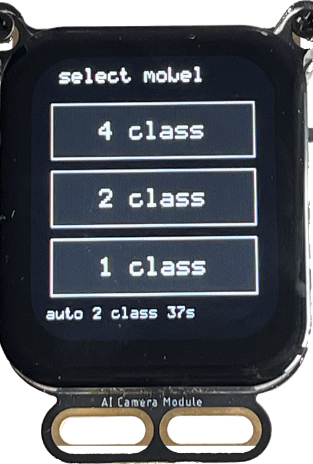

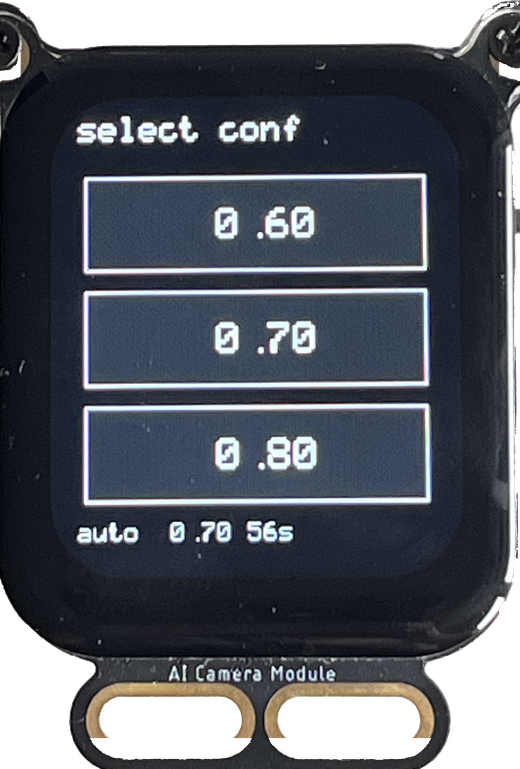

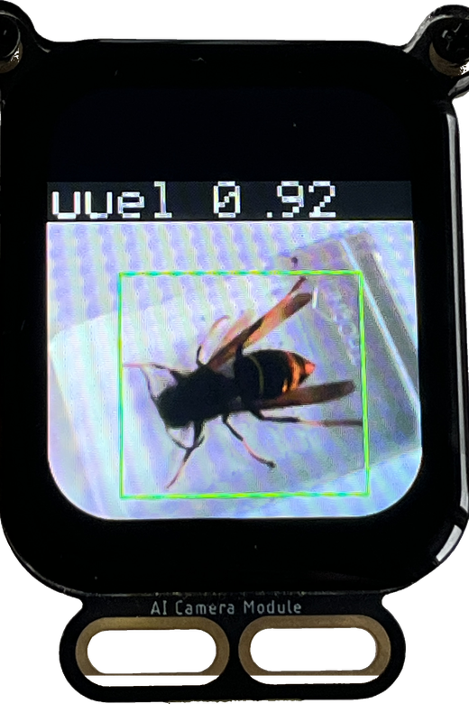

---

### [LSC Smart Connect slimme stekker](https://www.action.com/nl-nl/p/3202087/lsc-smart-connect-slimme-stekker/)

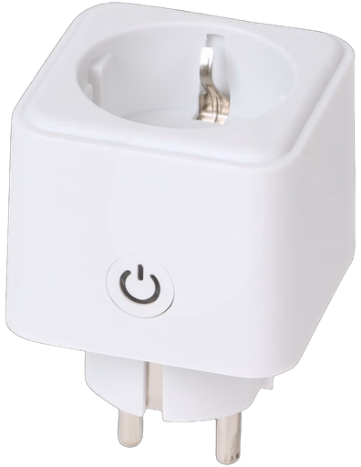

#### Open the plug and wire UART

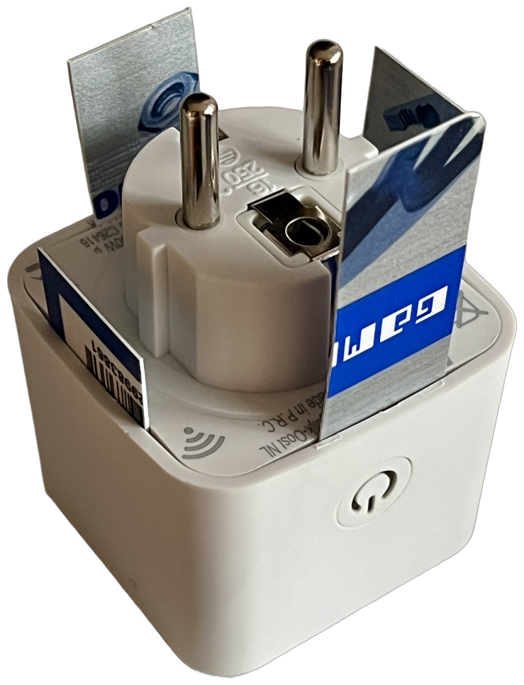

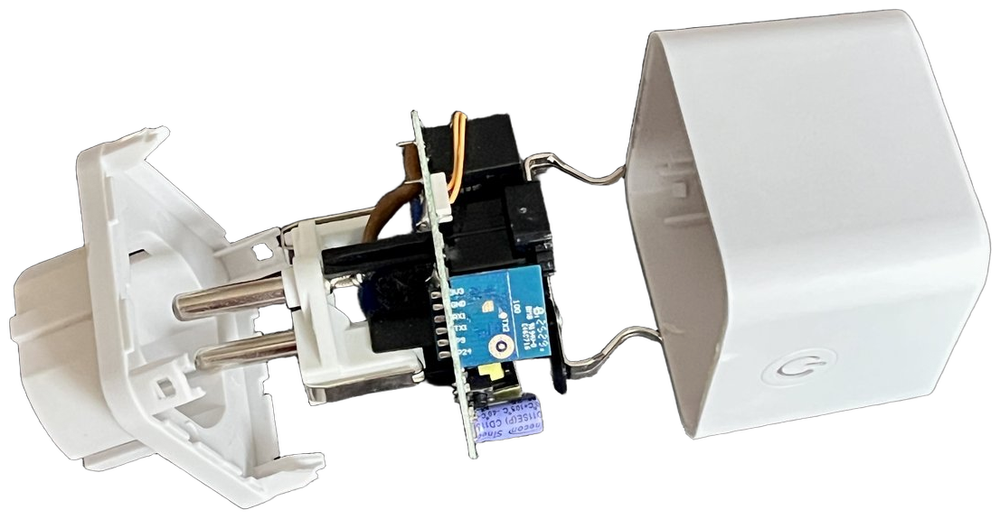

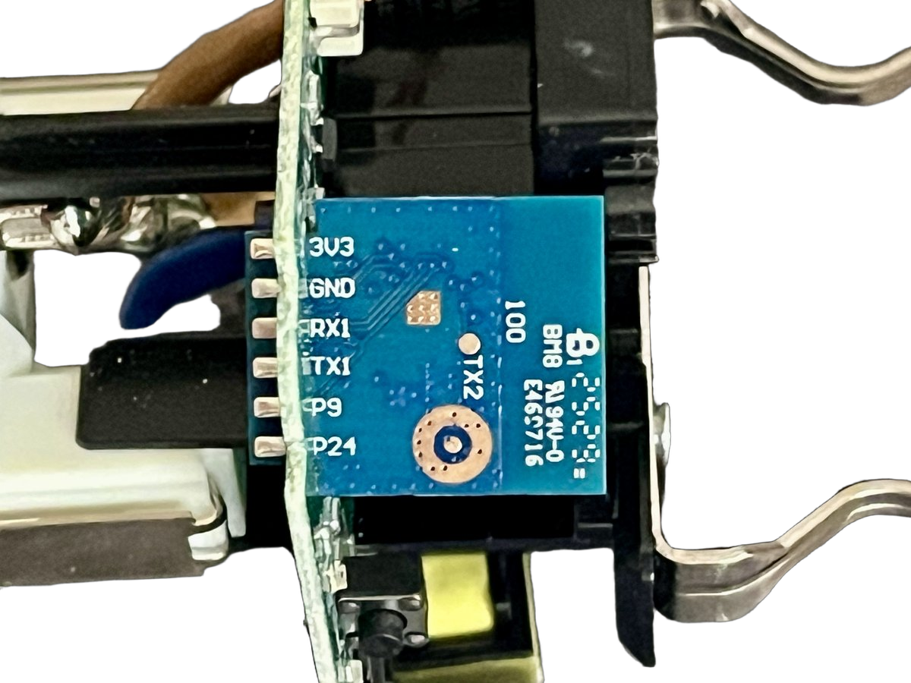

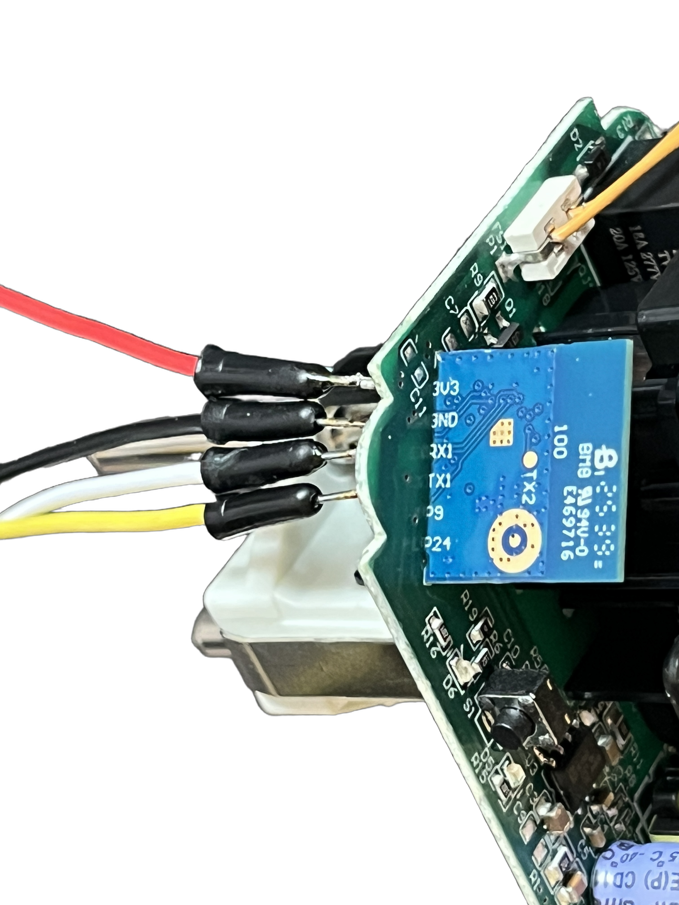

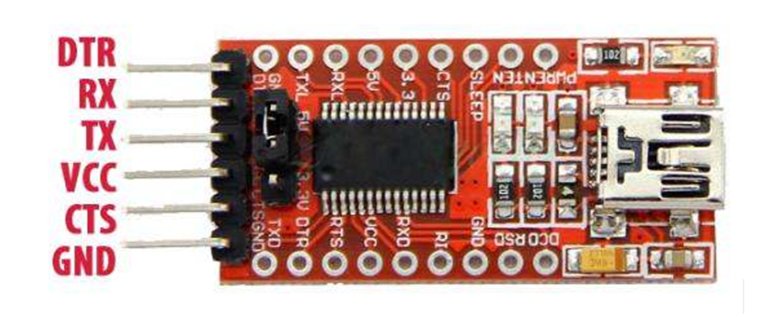

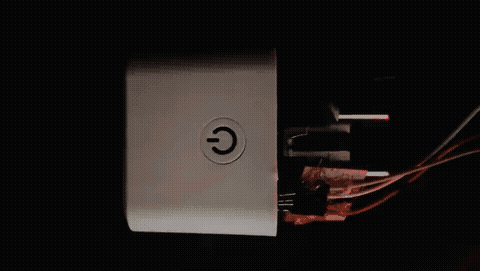

#### More usefull custom firmware with some smarter ideas

## 

## Flash warning

- Opening the device voids warranty.
- You can brick the device if wiring, dump, or flash goes wrong. Back up factory firmware first.
- Only modify hardware you **own** or have explicit permission to repair or open.
- EU Radio Equipment Directive (RED) is pushing more locked firmware; check feasibility before you open anything.

---

## Key safety reminders

- Use **caution** when working with mains voltage (230V).

---

## Learn more

- [Banned-book library inside a Wi-Fi smart bulb](https://gikiewicz.com/banned-book-library-in-a-wi-fi-smart-light-bulb)
- [Everything I Own, Owned](https://schlarp.com/posts/everything-i-own-owned/)

